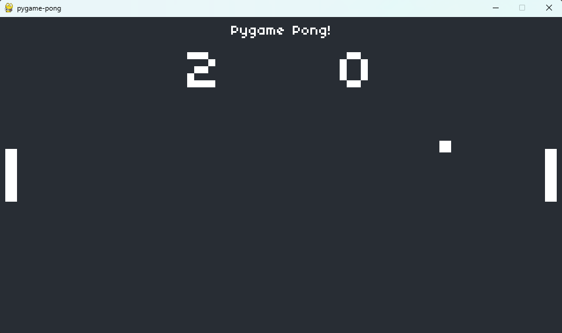
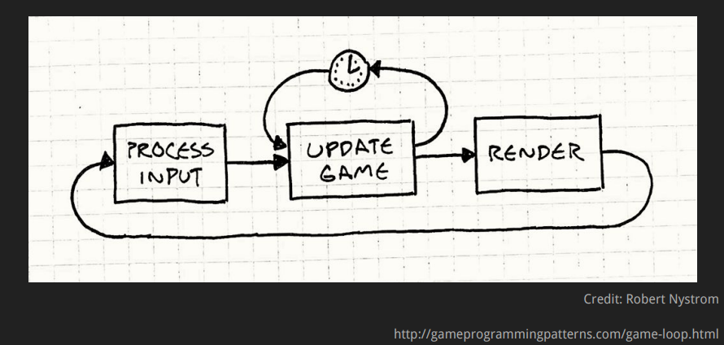
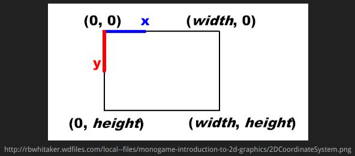

# Py-pong

## Expectativas

## O que é Pong?

Um jogo bem simples, porém muito famoso que consiste em dois retângulos que rebatem um quadrado pra pontuar.



## O que vamos aprender

* Desenhar formas básicas na tela (retângulos e quadrado);
* Controlar a posição dos retângulos baseado no input;
* Detecção de colisão entre a bola e os retângulos pra rebater a bola;
* Detecção de colisão entre a bola e os limites da tela pra rebater e pontuar;
* Efeitos sonoros;
* Contagem de pontos e determinação do vencedor.

## Variáveis, if, else, for, while: princípios básicos da programação

Na programação, utilizamos estruturas lógicas pra "controlar" o que está acontecendo. É com elas que "conversamos" com os computadores pra tentar garantir que eles repitam os passos que precisamos com precisão. Computador não executa errado. Pessoas programam errado.

### Variáveis

Variáveis são formas de salvar e reutilizar valores na programação.

```python
nome = "João"
idade = 32
nomes_dos_filhos = ["Maria", "José"]
endereco = {
    "rua": "Prudente de Morais",
    "numero": 123,
    "cidade": "Natal"
}
```

### If-else - "Se-senão"

Aqui temos a estrutura lógica mais básica, chamados de estruturas de controle. Basicamente definem se uma parte do código deve ser executada ou não, baseado em condições definidas pela pessoa desenvolvendo.

```bash
>>> if idade > 65:
...     print(nome + " é idoso.")
... else:
...     print(nome + " não é idoso.")
...
João não é idoso.
```

### For - While

Esses são chamados de estruturas de repetição. E é isso que eles fazem: repetir código!
For e While são coisas diferentes, mas decidi falar sobre eles juntos, pois têm funções parecidas.

O for é usado quando sabemos a quantidade de repetições, ou precisamos percorrer uma lista de valores.

```python
>>> for nome_do_filho in nomes_dos_filhos:
...     print(f"Nome do filho: {nome_do_filho}")
...
Nome do filho: Maria
Nome do filho: José
```

O while é usado quando não sabemos a quantidade de repetições, mas sabendo uma condição de parada.

```bash
>>> while idade < 35:
...     print(f"Um ano depois: {idade}")
...     idade += 1
...
Um ano depois: 32
Um ano depois: 33
Um ano depois: 34
```

## Um pouco de POO

Paradigma de programação (ou "forma de programar") que abstrai "entidades" de código

> Como assim?

Conseguimos agrupar partes do nosso código, chamadas de "classes" de forma que elas "imitem" o funcionamento de coisas no mundo real.

A partir das classes, "objetos" são criados. Eles possuem parâmetros e métodos que os permitem interagir entre si ou com o resto do sistema.

> Ainda tá confuso!

Quando você dirige um carro, não precisa se preocupar em como o sistema de injeção vai jogar combustível e oxigênio pros pistões e fazer o motor girar mais rápido quando precisa acelerar, só precisa pisar no acelerador. Não precisa saber como o fluido de freio vai ser injetado nas linhas de freio, encher os êmbolos das pinças, fazendo elas apertarem os discos, só precisa pisar no freio.

> Não importa a marca, tipo ou modelo do carro, você só precisa pisar nos pedais.

Pois é justamente isso que o POO tenta fazer com o código.
A classe Carro deve ter métodos (blocos de código reutilizáveis) que "sabem" o que fazer. Então, qualquer objeto da Classe carro, já deve "saber" o que fazer quando você chama esses métodos (pisa nos pedais)

```python
>>> class Carro:
...     def __init__(self, marca, tipo, modelo):
...         self.marca = marca
...         self.tipo = tipo
...         self.modelo = modelo
...     def acelerar(self):
...         print(f"Aumentando velocidade do {self.modelo}")
...     def freiar(self):
...         print(f"Reduzindo velocidade do {self.modelo}")
...
>>> carro_1 = Carro("Chevrolet", "Hatch", "Celta")
>>> carro_1.acelerar()
Aumentando velocidade do Celta
>>> carro_2 = Carro("Fiat", "Sedan", "Siena")
>>> carro_2.freiar()
Reduzindo velocidade do Siena
```

## Python, pacotes, bibliotecas e ambientes virtuais

> Pacotes ou bibliotecas, são conjuntos de métodos pré construídos que podemos reaproveitar no nosso código.

Isso foi um dos principais motivos da evolução da programação como conhecemos hoje, pois permitiu que códigos complexos fossem abstraídos para facilitar o fluxo de desenvolvimento.

Depois de instalar um pacote, temos acesso às suas funcionalidades no nosso código. É como se ensinássemos aquelas funcionalidades pro Python.

Porém, se instalamos muitos pacotes na nossa máquina, podemos gerar uma confusão entre funcionalidades, que podem se misturar entre osprogramas que estamos desenvolvendo.

É por isso que o Python possui o ambientes virtuais, que nos permitem "isolar" os pacotes de um projeto e rodar cada um deles separadamente. É como se pudéssemos definir um espaço separado onde nosso programa está.

```bash
~$ python -m venv .venv
~$ source .venv/bin/activate
~$ pip install pygame
~$ pip install -r requirements.txt
```

## Game loop

> Um jogo é um loop infinito, como um while true.



## Sistema de coordenadas

As coordenadas em um jogo 2D são como as cartesianas, porém o ponto (0,0) fica no canto superior esquerdo e o eixo Y é invertido.

> Ou seja: X cresce pra direita e Y cresce pra baixo.


